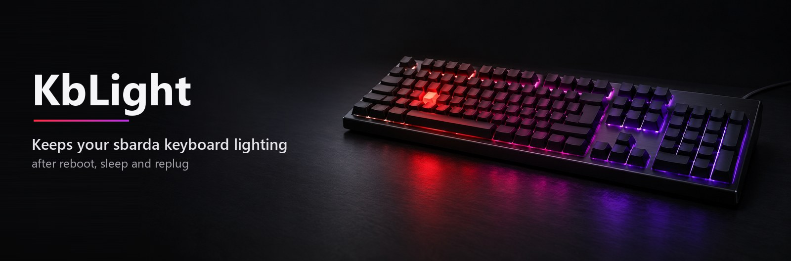
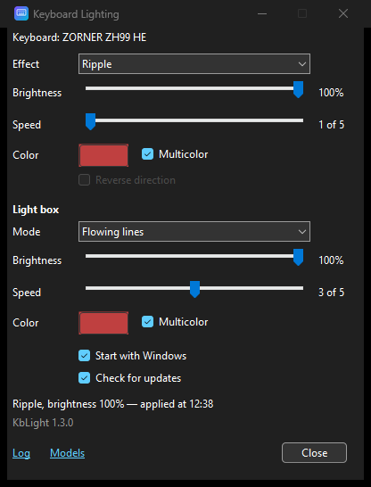

# KbLight — keeps the lighting of sbarda keyboards



*[Русский](README.ru.md) · [简体中文](README.zh-CN.md) · [Español](README.es.md) · [Português (Brasil)](README.pt-BR.md)*

A small Windows tray app that keeps the RGB lighting you chose on a keyboard configured with the **sbarda** app. Lighting only — key mapping, macros and actuation stay with sbarda.

Tested on **ZORNER ZH99 HE** (Hall Effect, USB `19F5:FB2A`). Other sbarda keyboards can be added with a model file — see [docs/ADDING-A-KEYBOARD.md](docs/ADDING-A-KEYBOARD.md). Without one, KbLight sends nothing to the keyboard.

## The problem it solves

- The keyboard's lighting resets after a reboot, after sleep or after unplugging it: you set an effect in sbarda, and next time the keyboard shows its default (on ZH99 HE — a fast "Wave").
- sbarda does not write the lighting back when it starts — it only reads the keyboard ([docs/PROTOCOL.md §6](docs/PROTOCOL.md#6-что-делает-sbardaexe-при-запуске)).
- sbarda's own autostart is broken: it adds a startup entry for `G68 Ultra.exe`, a file that does not exist, so Windows reports a missing program at every sign-in.

KbLight writes your lighting to the keyboard when you sign in to Windows, when the keyboard is plugged in, after sleep and whenever you change it in its window. Every write is read back and checked.

**Light box.** The ZH99 HE also has an RGB neon light box that sbarda cannot set at all — only Fn+Home (mode), Fn+PgUp (brightness) and Fn+PgDn (color) change it, and it resets on power loss like the main lighting. KbLight 1.3.0 keeps it too: the **Light box** group in the window picks the mode (flowing lines, flashing, steady color, breathing, off), brightness, speed and any RGB color, and it is written together with the main lighting. The Fn keys still work, but KbLight puts its own light box back on the next write (after sleep, on plug-in), so change it in the window. Upgrading from 1.2.0 keeps whatever the light box shows now.

<p align="center"></p>

## Install

1. Install the [.NET Desktop Runtime 10 (x64)](https://dotnet.microsoft.com/download/dotnet/10.0) if you do not have it — otherwise Windows offers the download link on the first start.
2. Download `KbLight.exe` from [Releases](https://github.com/lostintired/sbarda-kblight/releases/latest) and put it into `%LOCALAPPDATA%\Programs\KbLight\` (create the folder). Any folder works, but autostart points to wherever the exe was when you enabled it.
3. Run it. The exe is not signed, so SmartScreen may say "Windows protected your PC" — click **More info → Run anyway**.
4. In the window, tick **Start with Windows**.

On the first start KbLight writes nothing: it reads the lighting the keyboard has now and keeps it as yours. Pick an effect in the window, and from then on KbLight keeps that one. Right after a power cycle the keyboard shows its own default, so if KbLight's first start comes after a reboot, that default is what it takes — just choose your effect again.

KbLight checks GitHub for a newer release once a day — see [Updates](#updates).

The window, menu and log are in English, or in Russian if Windows is in Russian. To choose by hand, set the environment variable `KBLIGHT_LANG=en` or `ru` and restart KbLight.

## Remove the broken sbarda autostart entry

If Windows complains about `G68 Ultra.exe` at sign-in:

```
reg delete "HKCU\Software\Microsoft\Windows\CurrentVersion\Run" /v sbarda /f
reg delete "HKCU\Software\Microsoft\Windows\CurrentVersion\Explorer\StartupApproved\Run" /v sbarda /f
```

You do not need sbarda running for the lighting. If you open it for other settings, do not change the lighting there — KbLight puts its own back at the next sign-in. Do not enable sbarda's autostart.

## Updates

The window shows the version ("KbLight 1.3.0"); `KbLight.exe --version | Write-Output` prints it in PowerShell.

While the tray is running, KbLight asks GitHub for the latest release a minute after it starts and then once a day. If there is a newer one, the window shows a "version N is available" link and Windows shows a notification once; both open the release page. Nothing is downloaded or installed automatically: to update, exit KbLight, replace `KbLight.exe` with the new one and start it.

What goes over the network: one HTTPS request to `api.github.com/repos/lostintired/sbarda-kblight/releases/latest` with the header `User-Agent: KbLight/<version>` — nothing about you, your PC or your keyboard. To turn it off, untick **Check for updates** in the window (`"CheckUpdates": false` in `settings.json`). `--apply`, `--check`, `--autostart` and `--version` never go online.

## Where things are

| What | Where |
|---|---|
| Program | `%LOCALAPPDATA%\Programs\KbLight\KbLight.exe` |
| Settings and log | `%LOCALAPPDATA%\KbLight\settings.json`, `kblight.log` (the **Log** link in the window) |
| Your keyboard models | `%LOCALAPPDATA%\KbLight\models\*.json` (the **Models** link in the window) |
| Autostart | Task Scheduler task `KbLight` (at sign-in, `--tray`) |

## Command line

- no arguments — tray icon and the settings window (if KbLight is already running, it just shows its window);
- `--tray` — tray icon only, this is how autostart runs it;
- `--apply` — write the saved lighting and exit;
- `--check` — write it only if the keyboard has something else, then exit;
- `--autostart on|off` — turn autostart on or off;
- `--version` — print `KbLight <version>` and exit (KbLight is a windowed app, so in PowerShell pipe it: `KbLight.exe --version | Write-Output`).

Exit codes of `--apply` and `--check`: 0 — the lighting is set, 1 — keyboard not found, 2 — write failed, 3 — no `settings.json` yet (keyboard untouched), 4 — only keyboards without a model file were found.

## Uninstall

1. Right-click the tray icon → **Exit**.
2. `KbLight.exe --autostart off`.
3. Delete `%LOCALAPPDATA%\Programs\KbLight` and `%LOCALAPPDATA%\KbLight`.

## Build

```
dotnet build src -c Release
dotnet publish src -c Release -o publish    # publish\KbLight.exe, a single file
```

Needs the .NET 10 SDK. Releases are built by GitHub Actions from the tag (`.github/workflows/release.yml`). No NuGet packages, no admin rights. The icon is rebuilt with `python tools/make_icon.py` (needs Pillow).

## For developers

The project documents are in Russian:

- `openspec/specs/` — what the program must do, one file per capability;
- [docs/PROTOCOL.md](docs/PROTOCOL.md) — the keyboard's HID protocol, each finding marked as tested, derived or unknown;
- [docs/ARCHITECTURE.md](docs/ARCHITECTURE.md), [docs/ADR.md](docs/ADR.md), [docs/CHANGELOG.md](docs/CHANGELOG.md);
- `tools/kbtool.py` — read and write the keyboard's settings block directly (Python, standard library only);
- a fork that publishes its own releases changes the repository constant in `src/UpdateCheck.cs`.

Behaviour changes go through [OpenSpec](https://github.com/Fission-AI/OpenSpec): `/opsx:propose` → `/opsx:apply` → `/opsx:archive`. `CLAUDE.md` and `AGENTS.md` are the rules for coding agents.

## Disclaimer

KbLight is not affiliated with sbarda, ZORNER or any keyboard maker; all trademarks belong to their owners. The protocol was reconstructed for interoperability by analysing sbarda.exe and its traffic with the keyboard; no sbarda files are included in this repository. KbLight writes only the lighting bytes of the keyboard's settings block and leaves the rest as the keyboard reported it, but you use it at your own risk.

## License

[MIT](LICENSE)
