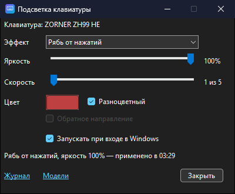

# KbLight — держит подсветку клавиатур sbarda


*[English version](README.md)*

Небольшая программа в трее Windows: держит выбранную вами RGB-подсветку клавиатуры, которую настраивают приложением **sbarda**. Только подсветка — раскладка, макросы и срабатывание клавиш остаются за sbarda.

Проверена на **ZORNER ZH99 HE** (Hall Effect, USB `19F5:FB2A`). Другие клавиатуры sbarda подключаются файлом модели — [docs/ADDING-A-KEYBOARD.md](docs/ADDING-A-KEYBOARD.md) (по-английски); без него программа в клавиатуру ничего не пишет.

## Какую проблему решает

- Подсветка клавиатуры сбрасывается после перезагрузки, сна или переподключения: выставили эффект в sbarda, а в следующий раз клавиатура показывает свой (у ZH99 HE — быструю «Волну»).
- sbarda при запуске подсветку обратно не пишет — только читает клавиатуру ([docs/PROTOCOL.md §6](docs/PROTOCOL.md#6-что-делает-sbardaexe-при-запуске)).
- Автозапуск самой sbarda сломан: она прописывает в автозагрузку `G68 Ultra.exe`, которого не существует, и Windows при каждом входе сообщает о пропавшей программе.

KbLight записывает вашу подсветку в клавиатуру при входе в Windows, при подключении клавиатуры, после сна и при каждом изменении в окне. Каждую запись перечитывает и сверяет.

<p align="center"></p>

## Установка

1. Поставить [.NET Desktop Runtime 10 (x64)](https://dotnet.microsoft.com/download/dotnet/10.0), если его нет, — иначе Windows сама предложит ссылку при первом запуске.
2. Скачать `KbLight.exe` из [Releases](https://github.com/lostintired/sbarda-kblight/releases/latest) и положить в `%LOCALAPPDATA%\Programs\KbLight\` (папку создать). Подойдёт любая папка, но автозапуск указывает туда, где exe лежал, когда его включали.
3. Запустить. Exe не подписан, поэтому SmartScreen может показать «Система Windows защитила ваш компьютер» — «Подробнее» → «Выполнить в любом случае».
4. В окне поставить флажок «Запускать при входе в Windows».

При первом запуске программа ничего не записывает: она читает подсветку, которая уже стоит в клавиатуре, и сохраняет её как вашу. Выберите эффект в окне — дальше KbLight держит его. Сразу после отключения питания клавиатура показывает свою подсветку по умолчанию, так что если первый запуск KbLight пришёлся на момент после перезагрузки, он возьмёт именно её — просто выберите свой эффект заново.

Раз в сутки KbLight проверяет на GitHub, не вышла ли новая версия, — см. [Обновления](#обновления).

Окно, меню и журнал — на языке Windows: по-русски для русской Windows, иначе по-английски. Выбрать вручную — переменная окружения `KBLIGHT_LANG=ru` или `en`, действует после перезапуска KbLight.

## Убрать сломанный автозапуск sbarda

Если Windows при входе жалуется на `G68 Ultra.exe`:

```
reg delete "HKCU\Software\Microsoft\Windows\CurrentVersion\Run" /v sbarda /f
reg delete "HKCU\Software\Microsoft\Windows\CurrentVersion\Explorer\StartupApproved\Run" /v sbarda /f
```

Запускать sbarda для подсветки не нужно. Если она понадобится для других настроек клавиатуры, подсветку в ней не меняйте: при следующем входе в Windows KbLight вернёт свою. Автозапуск в sbarda не включайте.

## Обновления

Окно показывает версию («KbLight 1.1.0»); в PowerShell её печатает `KbLight.exe --version | Write-Output`.

Пока трей работает, KbLight через минуту после запуска и затем раз в сутки спрашивает GitHub о последнем релизе. Если он новее, в окне появляется ссылка «доступна версия N», а Windows один раз показывает уведомление; оба открывают страницу релиза. Ничего не скачивается и не ставится само: чтобы обновиться, выйдите из KbLight, замените `KbLight.exe` новым и запустите.

Что уходит в сеть: один HTTPS-запрос к `api.github.com/repos/lostintired/sbarda-kblight/releases/latest` с заголовком `User-Agent: KbLight/<версия>` — ничего о вас, компьютере и клавиатуре. Выключить — снять флажок «Проверять обновления» в окне (`"CheckUpdates": false` в `settings.json`). `--apply`, `--check`, `--autostart` и `--version` в сеть не ходят.

## Где что лежит

| Что | Где |
|---|---|
| Программа | `%LOCALAPPDATA%\Programs\KbLight\KbLight.exe` |
| Настройки и журнал | `%LOCALAPPDATA%\KbLight\settings.json`, `kblight.log` (ссылка «Журнал» в окне) |
| Свои модели клавиатур | `%LOCALAPPDATA%\KbLight\models\*.json` (ссылка «Модели» в окне) |
| Автозапуск | задача планировщика `KbLight` (при входе, `--tray`) |

## Ключи запуска

- без ключей — трей и окно настроек (если программа уже запущена, она просто покажет окно);
- `--tray` — только трей, так её запускает автозапуск;
- `--apply` — записать подсветку из настроек и выйти;
- `--check` — записать, только если в клавиатуре стоит другое, и выйти;
- `--autostart on|off` — включить или выключить автозапуск;
- `--version` — напечатать `KbLight <версия>` и выйти (KbLight — оконная программа, поэтому в PowerShell через конвейер: `KbLight.exe --version | Write-Output`).

Коды возврата `--apply` и `--check`: 0 — подсветка стоит, 1 — клавиатура не найдена, 2 — сбой записи, 3 — `settings.json` ещё нет (клавиатура не тронута), 4 — найдены только клавиатуры без файла модели.

## Удаление

1. «Выход» в меню значка в трее.
2. `KbLight.exe --autostart off`.
3. Удалить `%LOCALAPPDATA%\Programs\KbLight` и `%LOCALAPPDATA%\KbLight`.

## Сборка

```
dotnet build src -c Release
dotnet publish src -c Release -o publish    # publish\KbLight.exe, один файл
```

Нужен .NET 10 SDK. Релизы собирает GitHub Actions по тегу (`.github/workflows/release.yml`). Без NuGet-пакетов и без прав администратора. Значок пересобирается скриптом `python tools/make_icon.py` (нужен Pillow).

## Документация и доработки

- `openspec/specs/` — что программа обязана делать, по файлу на каждую возможность;
- [docs/PROTOCOL.md](docs/PROTOCOL.md) — HID-протокол клавиатуры, у каждой находки пометка: проверено, выведено, не расшифровано;
- [docs/ARCHITECTURE.md](docs/ARCHITECTURE.md) — как программа устроена, [docs/ADR.md](docs/ADR.md) — принятые решения, [docs/CHANGELOG.md](docs/CHANGELOG.md) — версии;
- `tools/kbtool.py` — прямое чтение и запись блока настроек клавиатуры (Python, только стандартная библиотека);
- форк со своими релизами меняет константу репозитория в `src/UpdateCheck.cs`;
- `CLAUDE.md` и `AGENTS.md` — правила для агентов.

Доработки — через [OpenSpec](https://github.com/Fission-AI/OpenSpec): открыть Claude Code в папке проекта и начать с `/opsx:propose <что поменять>`, затем `/opsx:apply` и `/opsx:archive` (в Codex — `$openspec-propose` и далее).

## Оговорка

KbLight не связан с sbarda, ZORNER и производителями клавиатур; товарные знаки принадлежат владельцам. Протокол восстановлен для совместимости — разбором sbarda.exe и её обмена с клавиатурой; файлов sbarda в репозитории нет. KbLight пишет только байты подсветки в блоке настроек клавиатуры и оставляет остальное таким, каким его вернула клавиатура, но пользуетесь вы им на свой риск.

## Лицензия

[MIT](LICENSE)
